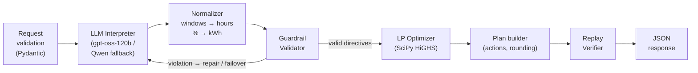

# GridWise LLM

**An API that reads campus operators' plain-English notes with an LLM, checks the result with deterministic guardrails, and returns the cheapest valid 24-hour energy plan.**

> Submission for the **BUP CSE Fest 2026 Hackathon — Online Preliminary** (in association with Poridhi.io)
> Challenge: _Smart Campus Energy Optimization — LLM-Assisted Operator Directive Interpretation_

|                              |                                                                             |
| ---------------------------- | --------------------------------------------------------------------------- |
| **Live API (base URL)**      | `https://bup-energy.vercel.app/`                                            |
| **Solution video (≤ 3 min)** | `https://drive.google.com/file/d/1j3WkQAf3ZbGdkm0hsKbU04m-a-OWEvTo/view?usp=sharing`                                                              |
| **Requirements spec**        | [`SRS.md`](SRS.md)                                                          |
| **Primary LLM**              | `openai/gpt-oss-120b` via Groq (OpenAI-compatible API)                      |
| **Secondary LLM**            | `gemini-2.0-flash` via Google Gemini (OpenAI-compatible API)                |
| **Solver**                   | SciPy `linprog` with the HiGHS LP solver                                    |

---

## Contents

1. [What it does](#1-what-it-does)
2. [Architecture](#2-architecture)
3. [How the LLM is used](#3-how-the-llm-is-used)
4. [Guardrails](#4-guardrails)
5. [Optimizer](#5-optimizer)
6. [Quickstart (local, from a clean machine)](#6-quickstart-local-from-a-clean-machine)
7. [Run with Docker (fallback image)](#7-run-with-docker-fallback-image)
8. [Configuration (environment variables)](#8-configuration-environment-variables)
9. [API reference](#9-api-reference)
10. [Testing against the public sample cases](#10-testing-against-the-public-sample-cases)
11. [Project structure](#11-project-structure)
12. [Reliability, performance and security](#12-reliability-performance-and-security)
13. [Known limitations](#13-known-limitations)
14. [Dependencies and credits](#14-dependencies-and-credits)

---

## 1. What it does

The campus runs on three energy sources:

- **grid electricity**, bought at a tariff that changes every hour
- **rooftop solar**
- a **battery**

For the next 24 hours, the service is given:

- hourly demand, solar forecast, and tariff
- the battery limits
- **1–3 operator notes** in plain English, for example _"Do not charge the battery between 2 PM and 4 PM."_ Some notes are real operating constraints; others are distractors such as _"The cafeteria menu changes tomorrow."_

GridWise LLM:

1. **Understands** each note with an LLM and classifies it as one of six directive types.
2. **Validates** the LLM's output with strict, deterministic guardrails. The LLM's output is never trusted as math.
3. **Applies** the valid directives as hard constraints in a linear program.
4. **Optimizes** the schedule for the minimum grid cost. The result is globally optimal for the interpreted directives.
5. **Verifies** the final plan hour by hour, the same way the judge does, before responding.

| Directive                 | Effect on the schedule                                                         |
| ------------------------- | ------------------------------------------------------------------------------ |
| `solar_reduction`         | Usable solar = forecast × `factor` in the listed hours                         |
| `minimum_battery_reserve` | Battery energy ≥ the reserve in the listed hours                               |
| `no_charge_window`        | Battery charging = 0 in the listed hours                                       |
| `no_discharge_window`     | Battery discharging = 0 in the listed hours                                    |
| `max_grid_window`         | Grid import ≤ the cap in the listed hours                                      |
| `no_op`                   | Irrelevant note, no effect (`applies = false`, `structured_adjustment = null`) |

---

## 2. Architecture



**Design principle.** Each job goes to the tool best suited to it:

| Stage                       | Tool                   | Reason                                                                  |
| --------------------------- | ---------------------- | ----------------------------------------------------------------------- |
| Understanding free text     | **LLM**                | Handles paraphrases such as "PV output", "one-fifth", or "13:00–15:00". |
| Checking the interpretation | **Deterministic code** | The same rules every time, and invented constraints are impossible.     |
| Scheduling                  | **LP solver**          | Exact, fast (under 50 ms), and provably minimum-cost.                   |

A full specification, with requirement IDs, the math model, the failure matrix, and rubric traceability, is in [`SRS.md`](SRS.md).

---

## 3. How the LLM is used

The LLM is **mandatory and central**. It produces the interpretation that the optimizer consumes. It is not used only for summaries.

- **One call per scenario.** All 1–3 notes are sent together, each tagged with its index. The LLM receives _only the notes_, never the demand, solar, tariff, or battery data, so it cannot alter base parameters.
- **Structured output.** The response is constrained by a strict JSON schema, with `temperature = 0` and the lowest reasoning effort.
- **Intermediate representation.** The LLM returns time **windows** (`start_hour`, exclusive `end_hour`) and, for reserves, an optional **percent of capacity**. Code then expands the windows into hour lists and converts percentages into kWh. This removes the two most common LLM mistakes: off-by-one hour ranges and arithmetic.
- **The prompt contains** the directive catalogue, the time and percentage normalization rules (for example, "80% reduction" gives `factor = 0.2`, while "drop _to_ 20%" also gives `0.2`), the relevance rules for `no_op`, and synthetic few-shot paraphrases. No public sample wording or values are hard-coded.

Example of what the LLM returns, before normalization:

```json
{
  "note_index": 0,
  "directive_type": "solar_reduction",
  "windows": [{ "start_hour": 12, "end_hour": 14 }],
  "factor": 0.25,
  "minimum_energy_kwh": null,
  "reserve_percent_of_capacity": null,
  "max_grid_kwh": null,
  "explanation": "Panel washing leaves about 25% usable solar from 12:00 to 14:00."
}
```

This becomes `{"hours": [12, 13], "factor": 0.25}`.

**Failover chain** (all providers are reached through the OpenAI-compatible Chat Completions API):

```
Primary (Groq · gpt-oss-120b) ──fail/timeout/429──▶ Secondary (Google Gemini · gemini-2.0-flash)
        │                                                   │
        └──── guardrail violation → 1 repair prompt ◀───────┘
                                   │ all LLM attempts failed
                                   ▼
                  Degraded rule-based parser (logged; never invents constraints)
```

The rule-based parser is a **last-resort safety net only**. It is never the primary interpreter.

---

## 4. Guardrails

The LLM output is treated as **untrusted data** until every check passes:

| Check               | Rule                                                                                                                          |
| ------------------- | ----------------------------------------------------------------------------------------------------------------------------- |
| Allowed types       | `directive_type` ∈ the six supported values. Anything else is rejected.                                                       |
| Note mapping        | Exactly one entry per note, with `note_index` = 0..N-1 and no gaps or duplicates.                                             |
| Hours               | Unique integers from 0 to 23, sorted ascending. Windows are start-inclusive and end-exclusive.                                |
| Solar factor        | 0 ≤ `factor` ≤ 1 (the fraction that _remains_).                                                                               |
| Battery reserve     | Finite, ≥ 0, and ≤ `capacity_kwh`.                                                                                            |
| Grid cap            | Finite and ≥ 0.                                                                                                               |
| `applies` semantics | `no_op` means `applies=false` and `structured_adjustment=null`. Every other type means `applies=true` with the exact key set. |
| No invention        | The interpretation cannot change demand, tariff, base solar, or battery parameters.                                           |
| Final replay        | After optimization, the plan is re-simulated hour by hour to prove every directive and energy rule holds.                     |

**On failure**, the service sends one repair prompt containing the violation list, then fails over to the next provider, then uses the degraded parser. A note that still cannot be interpreted safely becomes `no_op` with an explanation. **The service never crashes and never invents a directive.**

---

## 5. Optimizer

The service solves a **linear program** with SciPy's HiGHS solver. It has 120 continuous variables: grid, solar used, charge, discharge, and battery energy, for each of the 24 hours.

```
minimize   Σ tariff[h]·grid[h]  +  ε·Σ(charge[h] + discharge[h])        (ε = 1e-6)
s.t.       grid + solar_used + discharge = demand + charge                 every hour
           E[h] = E[h-1] + charge[h] − discharge[h],   E[-1] = initial
           E[23] = initial                                                 (end-of-day neutrality)
           reserve[h] ≤ E[h] ≤ capacity                                   (reserve raised by directives)
           0 ≤ charge ≤ max_charge (0 in no-charge hours)
           0 ≤ discharge ≤ max_discharge (0 in no-discharge hours)
           0 ≤ solar_used ≤ solar × factor                                (unused solar is curtailed)
           0 ≤ grid ≤ cap                                                  (no export; cap in capped hours)
```

- The ε term prevents simultaneous charging and discharging, so every hour maps cleanly to one `charge`, `discharge`, or `idle` action.
- Values are rounded to 4 decimals. Totals, cost, and peak are **recomputed from the returned `hourly_plan`**.
- **Validated:** with the ground-truth directives, the model reproduces the organizer's optimal cost on **all 10 public sample cases** (difference 0.00 BDT).

---

## 6. Quickstart (local, from a clean machine)

**Prerequisites:** Python 3.11+, Git, and an API key for the primary LLM provider (Groq). A Google Gemini key for the secondary provider is optional (free, no billing required — get one at [aistudio.google.com/apikey](https://aistudio.google.com/apikey)).

```bash
# 1. Clone
git clone https://github.com/redwanhasan980/BUP-CSE-Fest-The-Placeholder-text.git
cd gridwise-llm

# 2. Create a virtual environment and install dependencies
python -m venv .venv
source .venv/bin/activate            # Windows PowerShell: .venv\Scripts\Activate.ps1
pip install -r requirements.txt

# 3. Configure secrets (never commit .env)
cp .env.example .env                 # Windows: copy .env.example .env
#    then edit .env and set at least LLM_PRIMARY_API_KEY

# 4. Start the service
uvicorn app.main:app --host 0.0.0.0 --port 8000
```

In a second terminal:

```bash
# 5. Health check
curl -s http://localhost:8000/health
# → {"status":"ok"}

# 6. Optimize one public sample scenario
curl -s -X POST http://localhost:8000/optimize-energy \
     -H "Content-Type: application/json" \
     --data @examples/sample-01.request.json

# 7. Run all 10 public sample cases end-to-end
python scripts/run_public_samples.py --base-url http://localhost:8000
```

> On Windows PowerShell, use `curl.exe` instead of `curl`.

---

## 7. Run with Docker (fallback image)

The image binds **`0.0.0.0`**, exposes port **`8000`**, and contains **no secrets**. Keys are passed at run time.

```bash
# Pull the exact submitted tag
docker pull docker.io/<dockerhub-user>/gridwise-llm:v1.0.0

# Run (option A: inline variables)
docker run --rm -p 8000:8000 \
  -e LLM_PRIMARY_API_KEY=<your-groq-key> \
  -e LLM_SECONDARY_API_KEY=<your-gemini-key> \
  docker.io/<dockerhub-user>/gridwise-llm:v1.0.0

# Run (option B: from an env file)
docker run --rm -p 8000:8000 --env-file .env docker.io/<dockerhub-user>/gridwise-llm:v1.0.0

# Verify
curl -s http://localhost:8000/health        # → {"status":"ok"}
```

To build the image locally instead:

```bash
docker build -t gridwise-llm:local .
docker run --rm -p 8000:8000 --env-file .env gridwise-llm:local
```

---

## 8. Configuration (environment variables)

Only the **names** are listed here. Never commit values. `.env.example` contains the names with empty values.

| Variable                   | Required | Default                                                    | Description                                                                             |
| -------------------------- | -------- | ---------------------------------------------------------- | --------------------------------------------------------------------------------------- |
| `LLM_PRIMARY_API_KEY`      | **Yes**  | —                                                          | API key for the primary provider (Groq).                                                |
| `LLM_PRIMARY_BASE_URL`     | No       | `https://api.groq.com/openai/v1`                           | OpenAI-compatible base URL of the primary provider.                                     |
| `LLM_PRIMARY_MODEL`        | No       | `openai/gpt-oss-120b`                                      | Primary model identifier.                                                               |
| `LLM_SECONDARY_API_KEY`    | No       | —                                                          | API key for the secondary provider (Google Gemini). If empty, the secondary is skipped. |
| `LLM_SECONDARY_BASE_URL`   | No       | `https://generativelanguage.googleapis.com/v1beta/openai/` | OpenAI-compatible base URL of the secondary provider.                                   |
| `LLM_SECONDARY_MODEL`      | No       | `gemini-2.0-flash`                                         | Secondary model identifier.                                                             |
| `LLM_TIMEOUT_SECONDS`      | No       | `8`                                                        | Timeout for each LLM attempt.                                                           |
| `LLM_MAX_REPAIR_ATTEMPTS`  | No       | `1`                                                        | Repair prompts sent after a guardrail violation.                                        |
| `ENABLE_RULE_FALLBACK`     | No       | `true`                                                     | Enables the degraded parser when every LLM attempt fails.                               |
| `REQUEST_DEADLINE_SECONDS` | No       | `25`                                                       | Internal deadline (the judge timeout is 30 s).                                          |
| `PORT`                     | No       | `8000`                                                     | HTTP port.                                                                              |
| `LOG_LEVEL`                | No       | `INFO`                                                     | Log verbosity. Secrets are never logged at any level.                                   |

Any OpenAI-compatible provider works. Change the `*_BASE_URL` and `*_MODEL` values, with no code changes needed.

---

## 9. API reference

### `GET /health`

```json
200 OK
{"status": "ok"}
```

### `POST /optimize-energy`

**Request**

```json
{
  "scenario_id": "GRID-101",
  "operator_notes": [
    "Solar output will drop to about 20% from 1 PM to 3 PM.",
    "Do not charge the battery between 2 PM and 4 PM.",
    "The cafeteria menu changes tomorrow."
  ],
  "hours": [
    { "hour": 0, "demand_kwh": 180, "solar_kwh": 0, "tariff_bdt_per_kwh": 7 },
    "... 22 more hourly entries ...",
    { "hour": 23, "demand_kwh": 200, "solar_kwh": 0, "tariff_bdt_per_kwh": 9 }
  ],
  "battery": {
    "capacity_kwh": 500,
    "initial_energy_kwh": 200,
    "minimum_energy_kwh": 50,
    "max_charge_kwh_per_hour": 100,
    "max_discharge_kwh_per_hour": 100
  }
}
```

**Response `200 OK`** (abridged)

```json
{
  "scenario_id": "GRID-101",
  "directive_interpretation": [
    {
      "note_index": 0,
      "applies": true,
      "directive_type": "solar_reduction",
      "structured_adjustment": { "hours": [13, 14], "factor": 0.2 },
      "explanation": "Solar is expected to fall to about 20% from 13:00 to 15:00."
    },
    {
      "note_index": 1,
      "applies": true,
      "directive_type": "no_charge_window",
      "structured_adjustment": { "hours": [14, 15] },
      "explanation": "Battery charging is not allowed from 14:00 to 16:00."
    },
    {
      "note_index": 2,
      "applies": false,
      "directive_type": "no_op",
      "structured_adjustment": null,
      "explanation": "Cafeteria menu change does not affect the energy schedule."
    }
  ],
  "hourly_plan": [
    {
      "hour": 0,
      "grid_kwh": 180.0,
      "solar_used_kwh": 0.0,
      "battery_action": "idle",
      "battery_kwh": 0.0,
      "battery_energy_after_kwh": 200.0
    },
    "... 23 more entries (hours 1–23) ..."
  ],
  "total_grid_kwh": 0.0,
  "total_cost_bdt": 0.0,
  "peak_grid_kwh": 0.0,
  "plan_summary": "Applied 2 directives; 1 note ignored as no_op. ..."
}
```

_(The totals shown are placeholders. Real values are computed from the plan.)_

**Error responses** always use the shape `{"error": {"code": "...", "message": "..."}}`:

| Status | Code                                       | When                                                                                      |
| ------ | ------------------------------------------ | ----------------------------------------------------------------------------------------- |
| 400    | `MALFORMED_JSON`                           | The body is not valid JSON.                                                               |
| 400    | `INVALID_REQUEST`                          | Missing or mistyped fields, not exactly 24 unique hours 0–23, or not 1–3 non-empty notes. |
| 422    | `SEMANTIC_INVALID` / `INFEASIBLE_SCENARIO` | Well-formed but impossible values, or a base scenario with no feasible schedule.          |
| 500    | `INTERNAL_ERROR`                           | A controlled internal error, with no stack trace or secrets.                              |

---

## 10. Testing against the public sample cases

The public pack (`tests/data/public_sample_cases.json`) contains 10 worked cases.

```bash
# Unit tests: normalizer, guardrails, optimizer (vs reference costs), verifier
pytest -q

# End-to-end against a running service (local or deployed)
python scripts/run_public_samples.py --base-url http://localhost:8000
python scripts/run_public_samples.py --base-url https://<your-deployment-host>
```

For each case, the script:

1. POSTs `case.input`.
2. Compares `directive_interpretation` with the expected type, hours, and values. It does not compare explanation wording.
3. **Replays** `hourly_plan` independently: energy balance, effective solar, battery bounds and rates, directive windows, neutrality, and the totals.
4. Compares `total_cost_bdt` with the reference optimum (tolerance 0.01).

**Expected result:**

```
CASE        INTERPRETATION  PLAN VALID  COST (team / ref)       LATENCY
SAMPLE-01   PASS            PASS        38365.00 / 38365.00     ...
...
SAMPLE-10   PASS            PASS        41620.00 / 41620.00     ...
Summary: 10/10 passed
```

---

## 11. Project structure

```
gridwise-llm/
├── app/
│   ├── main.py              # FastAPI app, routes, error handlers, request deadline
│   ├── config.py            # Environment-variable settings
│   ├── schemas.py           # Pydantic request/response/IR models
│   ├── interpreter.py       # LLM → normalize → guardrails → repair/failover, cache
│   ├── guardrails.py        # Deterministic directive validation
│   ├── optimizer.py         # LP model (SciPy HiGHS)
│   ├── verifier.py          # Hour-by-hour replay of the final plan
│   ├── summary.py           # Deterministic plan_summary
│   └── llm/
│       ├── client.py        # OpenAI-compatible provider chain
│       ├── prompt.py        # System prompt + synthetic few-shot examples
│       └── rule_fallback.py # Degraded-mode parser (last resort only)
├── tests/
│   ├── data/public_sample_cases.json
│   └── test_*.py
├── scripts/run_public_samples.py
├── examples/sample-01.request.json
├── SRS.md
├── Dockerfile
├── .dockerignore
├── .env.example
├── requirements.txt
└── README.md
```

---

## 12. Reliability, performance and security

| Area            | What we do                                                                                                                                                                                  |
| --------------- | ------------------------------------------------------------------------------------------------------------------------------------------------------------------------------------------- |
| **Latency**     | One LLM call per scenario, and an LP solve in under 50 ms. Typical end-to-end time is about 1–3.5 s, against a p95 target of ≤ 5 s and a judge timeout of 30 s.                             |
| **Health**      | `/health` never calls the LLM and is ready within seconds of start.                                                                                                                         |
| **Resilience**  | Two independent LLM providers, a repair loop, a degraded parser, and a 25 s internal deadline. Valid requests never return 5xx.                                                             |
| **Determinism** | `temperature = 0` and an in-memory interpretation cache, so repeated requests give identical answers and use less rate limit.                                                               |
| **Concurrency** | The solver runs in a worker thread, so the event loop is never blocked.                                                                                                                     |
| **Secrets**     | Supplied only through environment variables. `.env` is git-ignored and docker-ignored, and the image holds no credentials. Logs and responses never contain keys, prompts, or stack traces. |
| **Data**        | Only the synthetic scenario data sent by the harness is processed. Nothing is persisted.                                                                                                    |

---

## 13. Known limitations

- **External LLM dependency.** Interpretation quality and latency depend on provider availability and free-tier rate limits. The failover chain reduces this risk but does not remove it.
- **Degraded mode is less accurate.** If every LLM provider fails, the rule-based parser handles common phrasings only. Unrecognized notes become `no_op` rather than guessed constraints.
- **One directive per note.** This follows the challenge specification. A note that combines two different restrictions is mapped to its dominant directive.
- **Ambiguous time phrases.** When AM/PM is omitted, the hours are inferred from context (for example, solar implies daylight). Unusual vague phrases ("late evening") may be interpreted differently from the organizer's intent.
- **Simplified physics.** Following the challenge rules, there are no battery efficiency losses, no grid export, and 1-hour resolution.
- **The cache is per process.** It is not shared across replicas or restarts.

---

## 14. Dependencies and credits

| Dependency                                                                     | Purpose                               | License     |
| ------------------------------------------------------------------------------ | ------------------------------------- | ----------- |
| [FastAPI](https://fastapi.tiangolo.com/) + [Uvicorn](https://www.uvicorn.org/) | HTTP API and ASGI server              | MIT / BSD-3 |
| [Pydantic v2](https://docs.pydantic.dev/)                                      | Request, response, and IR validation  | MIT         |
| [NumPy](https://numpy.org/) + [SciPy](https://scipy.org/) (HiGHS solver)       | Linear programming                    | BSD-3 / MIT |
| [OpenAI Python SDK](https://github.com/openai/openai-python)                   | Client for OpenAI-compatible LLM APIs | Apache-2.0  |
| [pytest](https://pytest.org/) + [httpx](https://www.python-httpx.org/)         | Testing                               | MIT / BSD-3 |

**LLM providers and models:** [Groq](https://console.groq.com/) (`openai/gpt-oss-120b`, an open-weight model) and [Google Gemini](https://aistudio.google.com/) (`gemini-2.0-flash`, accessed through Gemini's OpenAI-compatible endpoint).

**AI assistance:** AI coding assistants were used for documentation and scaffolding support, as permitted by the official rulebook. The architecture, logic, and validation are the team's own work.

**Challenge material:** the Problem Statement, Participant Guide, and Public Sample Cases are © BUP CSE Fest 2026 organizers. All scenario data is synthetic.
