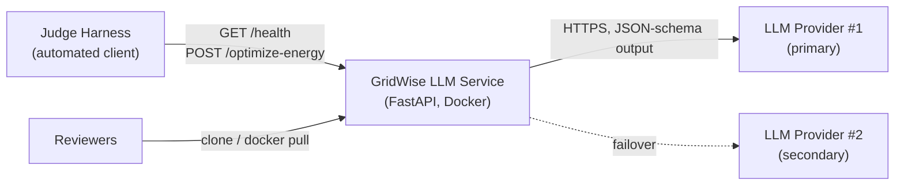
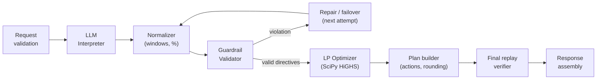

# Software Requirements Specification

## GridWise LLM — LLM-Assisted Smart Campus Energy Optimization Service

| Field | Value |
|---|---|
| Document | Software Requirements Specification (SRS) |
| Product | GridWise LLM (`gridwise-llm`) |
| Event | BUP CSE Fest 2026 Hackathon — Online Preliminary (in association with Poridhi.io) |
| Version | 1.0 |
| Date | 18 September 2026 |
| Status | Baseline for implementation |
| Source documents | Problem Statement (canonical), Participant Guide & Evaluation Rubric, Public Sample Cases JSON v2.0 |

---

## Table of Contents

1. [Introduction](#1-introduction)
2. [Overall Description](#2-overall-description)
3. [System Architecture](#3-system-architecture)
4. [External Interface Requirements](#4-external-interface-requirements)
5. [Functional Requirements](#5-functional-requirements)
6. [Operator-Note Interpretation Specification](#6-operator-note-interpretation-specification)
7. [Optimization Model Specification](#7-optimization-model-specification)
8. [Guardrail and Verification Specification](#8-guardrail-and-verification-specification)
9. [Error Handling and Safe Failure](#9-error-handling-and-safe-failure)
10. [Non-Functional Requirements](#10-non-functional-requirements)
11. [Deployment, Repository and Submission Requirements](#11-deployment-repository-and-submission-requirements)
12. [Verification and Test Plan](#12-verification-and-test-plan)
13. [Traceability to the Evaluation Rubric](#13-traceability-to-the-evaluation-rubric)
14. [Risks and Mitigations](#14-risks-and-mitigations)
15. [Assumptions, Ambiguities and Decisions](#15-assumptions-ambiguities-and-decisions)
16. [Appendices](#16-appendices)

---

## 1. Introduction

### 1.1 Purpose

This document specifies the complete functional and non-functional requirements for **GridWise LLM**, an HTTP API service that:

1. reads 1–3 free-text campus operator notes with a large language model (LLM),
2. converts each note into a strictly typed, machine-checkable directive,
3. validates those directives with deterministic guardrails,
4. applies them to a 24-hour battery/solar/grid scheduling problem, and
5. returns a provably valid, minimum-cost 24-hour energy plan.

It is the single reference for design, implementation, testing, and submission. It is written for the development team, and it doubles as architecture evidence for the organizers' reviewers.

### 1.2 Scope

**In scope**

- `GET /health` and `POST /optimize-energy`, exactly as defined by the Problem Statement.
- An LLM-based interpretation of operator notes into six directive types.
- Deterministic normalization, guardrails, optimization (linear programming), and a final replay verifier.
- A Docker image, public deployment, README, and a test harness for the public sample cases.

**Out of scope**

- Grid export or selling energy, battery efficiency losses, and battery degradation.
- Any live campus, utility, billing, or personal data. All data is synthetic.
- Any user interface, authentication, or persistence beyond an in-memory cache.
- Directive types not listed in Problem Statement §04.

### 1.3 Definitions and Acronyms

| Term | Definition |
|---|---|
| **Scenario** | One request: `scenario_id`, 24 hourly entries, battery parameters, and 1–3 operator notes. |
| **Operator note** | A natural-language string written by campus staff. It may be relevant or a distractor. |
| **Directive** | The typed interpretation of a single note: one of `solar_reduction`, `minimum_battery_reserve`, `no_charge_window`, `no_discharge_window`, `max_grid_window`, `no_op`. |
| **structured_adjustment** | The exact machine-checkable parameter object for a directive (Problem Statement §04). |
| **Effective solar** | `solar_kwh[h] × factor` for hours affected by `solar_reduction`, otherwise `solar_kwh[h]`. |
| **Guardrail** | A deterministic check applied to LLM output before it can influence the optimizer. |
| **Replay / verifier** | An hour-by-hour re-simulation of the output plan that checks every constraint, mirroring the judge. |
| **Neutrality** | The rule that battery energy after hour 23 must equal the initial battery energy. |
| **LP** | Linear Program. **HiGHS** is the open-source LP solver bundled with SciPy. |
| **Judge / harness** | The organizers' automated evaluation client. |
| **IR** | Intermediate Representation: the LLM's raw structured output before normalization. |
| **M / S / C** | Requirement priority: **Must**, **Should**, **Could**. |

### 1.4 References

| ID | Document | Authority |
|---|---|---|
| [PS] | BUP CSE Fest 2026 — Preliminary Problem Statement (GridWise LLM) | **Canonical** for endpoints, schemas, directives, guardrails, battery rules, and optimization validity |
| [PG] | Participant Guide & Evaluation Rubric (GridWise LLM) | Canonical for deployment, repository, submission, scoring, penalties, and tie-breaks |
| [SC] | Public Sample Cases JSON v2.0 (10 cases) | Reference examples only. They are **not** the hidden judge set. |

When [PS] and [PG] disagree about directives, schemas, guardrails, battery behavior, or optimization validity, **[PS] prevails** ([PG] §03).

### 1.5 Document Conventions

- Requirements are written as **"The system shall …"** and carry a unique ID (`FR-…`, `NFR-…`, `DR-…`), a priority (M/S/C), and a source reference.
- Hours are integers from 0 to 23. Energy is in kWh. Money is in BDT.
- Time windows are **start-inclusive and end-exclusive** everywhere in this document.

---

## 2. Overall Description

### 2.1 Product Perspective

GridWise LLM is a stateless microservice. The judge harness is its only production client. It depends on one or more external LLM providers reached over HTTPS through an OpenAI-compatible Chat Completions API.



### 2.2 Product Functions (summary)

| # | Function |
|---|---|
| F1 | Report readiness through `GET /health`. |
| F2 | Validate the scenario request structure and semantics. |
| F3 | Interpret every operator note with an LLM into a typed IR. |
| F4 | Normalize the IR (time windows, percentages) into the exact `structured_adjustment` shapes. |
| F5 | Apply deterministic guardrails. Repair or fail over when they are violated. |
| F6 | Build and solve a cost-minimizing LP that includes all applicable directives. |
| F7 | Convert the LP solution into the required `hourly_plan` (charge/discharge/idle). |
| F8 | Replay-verify the plan against every rule before responding. |
| F9 | Assemble totals, peak, a plan summary, and the directive interpretation, then respond. |

### 2.3 Actors

| Actor | Description | Interaction |
|---|---|---|
| Judge harness | An automated client that sends public-style and hidden scenarios, sometimes repeatedly. | HTTP requests with a 30-second timeout per request. |
| Organizer reviewer | A person verifying reproducibility, the repository, the Docker image, and the video. | Reads the README, runs Docker or a local quickstart. |
| Development team | Builds, tests, deploys, and submits. | Code, CI scripts, the deployment platform. |
| LLM provider | An external generative model API. | Receives notes only. It never receives secrets or scenario numbers that it could alter. |

### 2.4 Operating Environment

| Item | Specification |
|---|---|
| Runtime | Python 3.11+ |
| Web stack | FastAPI + Uvicorn (ASGI) |
| Validation | Pydantic v2 |
| Solver | SciPy `optimize.linprog(method="highs")` |
| LLM access | The `openai` Python SDK against OpenAI-compatible endpoints (for example Groq or Cerebras) |
| Container | Docker, base image `python:3.11-slim`, binds `0.0.0.0:${PORT}` (default 8000) |
| Hosting | Any publicly reachable platform (for example Render or Railway), with no login or VPN required |

### 2.5 Design and Implementation Constraints

| ID | Constraint | Source |
|---|---|---|
| C-01 | A language-capable generative model **must** be in the operator-note interpretation path. It must directly produce the structured interpretation that the optimizer consumes. | [PS] §02, [PG] §04 |
| C-02 | Using the LLM only for `plan_summary` or documentation is non-compliant and disqualifies the team from the shortlist. | [PS] §02, [PG] §09 |
| C-03 | Hard-coded phrase matching must not be the sole interpreter. | [PG] §04 |
| C-04 | Endpoint names and JSON field names must match exactly. | [PS] §06, [PG] §03 |
| C-05 | No runtime training or fine-tuning during evaluation. | [PG] §03 |
| C-06 | No secrets in the repository, image, logs, or responses. | [PG] §04 |
| C-07 | The repository is created after the question is revealed, is private during the event, and is made public after the deadline. | [PG] §02, §04 |
| C-08 | The development window is 4 hours (7:00–11:00 PM, Asia/Dhaka). | [PS], [PG] |
| C-09 | External tools and libraries must be credited in the README. Core architecture and logic are the team's own work. | [PG] §04 |

### 2.6 Assumptions and Dependencies

- LLM provider keys, quota, and rate limits are the team's responsibility ([PG] §03, §04).
- Judge scenarios are feasible under the ground-truth interpretation and never require contradictory hard directives ([PS] §05.1, §08).
- Each hidden note maps to exactly one supported directive type or to `no_op` ([PS] §11.4, [PG] §10).
- Section 15 lists further interpretation assumptions.

---

## 3. System Architecture

### 3.1 Pipeline

The architecture mirrors [PS] §03: **the LLM understands the language, deterministic code validates, and the optimizer does the math.**



### 3.2 Component Responsibilities

| Component | Module (planned) | Responsibility |
|---|---|---|
| API layer | `app/main.py` | Routes, exception handlers, HTTP status mapping, request deadline. |
| Configuration | `app/config.py` | Loads environment variables. Never logs secret values. |
| Schemas | `app/schemas.py` | Pydantic models for the request, response, IR, and `structured_adjustment`. |
| LLM client | `app/llm/client.py` | Ordered provider chain, timeouts, retries, JSON-schema response format. |
| Prompt | `app/llm/prompt.py` | System prompt, directive catalogue, normalization rules, few-shot examples. |
| Rule fallback | `app/llm/rule_fallback.py` | A degraded-mode regex parser, used **only** when every LLM attempt fails. |
| Interpreter | `app/interpreter.py` | Orchestrates LLM → normalize → guardrails → repair. Caches by note hash. |
| Guardrails | `app/guardrails.py` | All checks in §8.1. Returns a typed pass/fail with reasons. |
| Optimizer | `app/optimizer.py` | Builds and solves the LP in §7 and handles infeasibility. |
| Verifier | `app/verifier.py` | Replays the plan against every rule in §8.2. |
| Summary | `app/summary.py` | A deterministic, human-readable `plan_summary`. |

### 3.3 Request Lifecycle (sequence)

```mermaid
sequenceDiagram
    participant J as Judge
    participant API as FastAPI
    participant INT as Interpreter
    participant LLM as LLM Provider(s)
    participant G as Guardrails
    participant OPT as LP Optimizer
    participant V as Verifier
    J->>API: POST /optimize-energy (scenario)
    API->>API: Validate schema (400/422 on failure)
    API->>INT: notes + battery capacity
    INT->>INT: Cache lookup (hash of notes + capacity)
    INT->>LLM: One call with all notes (JSON schema, temperature 0)
    LLM-->>INT: IR for each note
    INT->>G: Normalize + validate
    alt guardrail violation
        INT->>LLM: Repair prompt with error list, or the next provider
    end
    G-->>INT: Valid directives
    INT-->>API: directive_interpretation[]
    API->>OPT: hours + battery + directives
    OPT-->>API: grid, solar, charge, discharge, energy per hour
    API->>V: Replay plan
    V-->>API: OK (or a controlled error)
    API-->>J: 200 JSON response
```

---

## 4. External Interface Requirements

### 4.1 Endpoints

| Method | Path | Success | Description |
|---|---|---|---|
| GET | `/health` | `200 {"status": "ok"}` | Readiness. It must not call the LLM or depend on it. |
| POST | `/optimize-energy` | `200` with the response object | Interpretation plus the 24-hour plan. |

### 4.2 HTTP Status Codes

| Code | When |
|---|---|
| 200 | Successful health check, or successful optimization. |
| 400 | Malformed JSON, or a structurally invalid request: missing or extra-typed fields, wrong array sizes, empty notes, or hours not exactly {0..23}. |
| 422 | A well-formed but semantically impossible request, for example negative energy, `minimum_energy_kwh > capacity_kwh`, an initial energy outside its bounds, or a base scenario that is infeasible. |
| 500 | A controlled, unexpected internal error. It carries a generic message and never a stack trace or secrets. |

Every error body uses the shape `{"error": {"code": "<MACHINE_CODE>", "message": "<safe human text>"}}`.

### 4.3 Request Schema — `POST /optimize-energy`

| Field | Type | Constraint |
|---|---|---|
| `scenario_id` | string | Required and non-empty. It is echoed back unchanged. |
| `operator_notes` | array of string | Required. 1–3 items, each non-empty after trimming. |
| `hours` | array of object (24) | Required. Exactly 24 entries whose `hour` values are unique and form exactly {0..23}. Any order is accepted, and entries are sorted internally. |
| `hours[].hour` | integer | 0–23 |
| `hours[].demand_kwh` | number | Finite and ≥ 0 |
| `hours[].solar_kwh` | number | Finite and ≥ 0 (base solar before adjustments) |
| `hours[].tariff_bdt_per_kwh` | number | Finite |
| `battery.capacity_kwh` | number | Finite and ≥ 0 |
| `battery.initial_energy_kwh` | number | Finite, with `minimum_energy_kwh ≤ initial ≤ capacity` |
| `battery.minimum_energy_kwh` | number | Finite, with `0 ≤ min ≤ capacity` |
| `battery.max_charge_kwh_per_hour` | number | Finite and ≥ 0 |
| `battery.max_discharge_kwh_per_hour` | number | Finite and ≥ 0 |

Unknown extra fields are **ignored**, not rejected, for forward compatibility.

### 4.4 Response Schema

| Field | Type | Rule |
|---|---|---|
| `scenario_id` | string | Equals the request's `scenario_id`. |
| `directive_interpretation` | array | Exactly N entries (N = the number of notes), with `note_index` equal to 0..N-1 in order. |
| `directive_interpretation[].note_index` | integer | Zero-based index of the note. |
| `directive_interpretation[].applies` | boolean | `false` **only** for `no_op`, `true` otherwise. |
| `directive_interpretation[].directive_type` | string enum | One of the six supported types. |
| `directive_interpretation[].structured_adjustment` | object or null | The exact shape from §6.1, or `null` only for `no_op`. |
| `directive_interpretation[].explanation` | string | Short (≤ 240 characters) and free text. It is not scored byte-for-byte. |
| `hourly_plan` | array (24) | One entry for each hour 0..23, in ascending order. |
| `hourly_plan[].hour` | integer | 0–23 |
| `hourly_plan[].grid_kwh` | number | ≥ 0 |
| `hourly_plan[].solar_used_kwh` | number | 0 ≤ value ≤ effective solar |
| `hourly_plan[].battery_action` | string enum | `charge`, `discharge`, or `idle` |
| `hourly_plan[].battery_kwh` | number | ≥ 0 magnitude, and exactly 0 when the action is `idle` |
| `hourly_plan[].battery_energy_after_kwh` | number | Battery energy after the hour |
| `total_grid_kwh` | number | Σ `grid_kwh` |
| `total_cost_bdt` | number | Σ `grid_kwh × tariff` |
| `peak_grid_kwh` | number | max `grid_kwh` |
| `plan_summary` | string | A short human-readable strategy description. |

### 4.5 Software Interfaces — LLM Provider

| Item | Specification |
|---|---|
| Protocol | HTTPS, OpenAI-compatible `POST /chat/completions` |
| Output mode | `response_format = json_schema` (strict) where supported, otherwise `json_object` plus Pydantic validation |
| Sampling | `temperature = 0`, with reasoning effort set to the lowest supported level for reasoning models |
| Payload | The operator notes (and their indices) only. No API keys, no demand, solar, or tariff data. |
| Calls | **One call for each scenario** covering all notes (maximum 3), plus at most one repair call |

---

## 5. Functional Requirements

### 5.1 API and Health (FR-API)

| ID | Requirement | Pri | Source |
|---|---|---|---|
| FR-API-01 | The system shall expose `GET /health` returning HTTP 200 with the body `{"status":"ok"}`. | M | PS §06.2 |
| FR-API-02 | `/health` shall not depend on LLM availability, and it shall be ready within 60 s of container start. | M | PG §08 |
| FR-API-03 | The system shall expose `POST /optimize-energy`, accepting and returning `application/json`. | M | PS §06 |
| FR-API-04 | Endpoint paths shall match exactly, with no trailing-slash redirect and no path prefix. | M | PS §06 |
| FR-API-05 | The system shall map errors to the status codes in §4.2, using the safe error body. | M | PS §06.1 |

### 5.2 Request Validation (FR-REQ)

| ID | Requirement | Pri | Source |
|---|---|---|---|
| FR-REQ-01 | The system shall reject a body that is not valid JSON with HTTP 400. | M | PS §06.1 |
| FR-REQ-02 | The system shall reject missing required fields or wrong types with HTTP 400. | M | PS §07 |
| FR-REQ-03 | The system shall require `operator_notes` to hold 1–3 non-empty strings, otherwise HTTP 400. | M | PS §07 |
| FR-REQ-04 | The system shall require exactly 24 hour entries with unique `hour` values forming {0..23}, otherwise HTTP 400. | M | PS §07 |
| FR-REQ-05 | The system shall reject non-finite (NaN or ∞) or negative energy and battery values with HTTP 422. | S | PS §08, PG §08 |
| FR-REQ-06 | The system shall reject battery parameters where `min > capacity` or where `initial` lies outside `[min, capacity]`, with HTTP 422. | S | PS §09.2 |
| FR-REQ-07 | The system shall sort hour entries by `hour` before processing. | M | PS §07 |

### 5.3 LLM Interpretation (FR-LLM)

| ID | Requirement | Pri | Source |
|---|---|---|---|
| FR-LLM-01 | The system shall interpret **every** operator note with an LLM. The LLM output shall directly determine each note's directive type and parameters. | M | PS §02, PG §04 |
| FR-LLM-02 | The system shall send all notes of a scenario in one LLM call, tagging each note with its index. | S | NFR-PERF |
| FR-LLM-03 | The LLM shall return the IR defined in Appendix A. The IR shall be requested through a strict JSON schema where the provider supports it. | M | PS §08 |
| FR-LLM-04 | The prompt shall contain the directive catalogue, the normalization rules of §6, the relevance rules of §6.3, and few-shot examples that are **paraphrases, not copies** of the public notes. | M | PS §11.4, SC `_meta` |
| FR-LLM-05 | The system shall use `temperature = 0` and a bounded `max_tokens` value. | M | NFR-PERF |
| FR-LLM-06 | The system shall support an ordered provider chain (primary, then secondary), configurable by environment variables. | M | PG §03 |
| FR-LLM-07 | Each LLM attempt shall have a timeout (default 8 s). Across all attempts, the LLM stage shall not exceed 20 s. | M | PG §08 |
| FR-LLM-08 | On a guardrail violation, the system shall make **one** repair attempt, sending the violation list back to the LLM. It shall then fail over to the next provider. | S | PS §08 Safe failure |
| FR-LLM-09 | If every LLM attempt fails, the system shall use the rule-based fallback parser (degraded mode) and log the event. If the fallback cannot parse a note confidently, that note becomes `no_op` with an explanatory message. No constraint shall ever be invented. | S | PS §08, PG §04 |
| FR-LLM-10 | The system shall cache validated interpretations in memory, keyed by `sha256(notes + capacity_kwh)`, with an LRU policy capped at about 512 entries. | C | PG §10 tie-break 8 |
| FR-LLM-11 | The LLM shall never modify, and shall not receive, demand, solar, tariff, or battery base parameters. Only `capacity_kwh` is used, and only by deterministic code, to convert percentages. | M | PS §05.1, §08 |

### 5.4 Normalization (FR-NRM)

| ID | Requirement | Pri | Source |
|---|---|---|---|
| FR-NRM-01 | The system shall expand every IR window `[start_hour, end_hour)` into integer hours. `end_hour` = 24 means midnight at the end of the day. | M | PS §05.1 |
| FR-NRM-02 | Windows where `end_hour < start_hour` shall wrap over midnight, for example 22→2 gives [22, 23, 0, 1]. | S | §15 A-04 |
| FR-NRM-03 | The final `hours` list shall be deduplicated and sorted ascending. | M | PS §05.1 |
| FR-NRM-04 | A reserve expressed as a percentage of capacity shall be converted deterministically as `minimum_energy_kwh = percent / 100 × capacity_kwh`. | M | SC SAMPLE-03 |
| FR-NRM-05 | `structured_adjustment` shall contain **exactly** the keys required for its type (§6.1) and nothing more. | M | PS §04.1 |
| FR-NRM-06 | `applies` shall be derived deterministically: `false` if and only if the type is `no_op`. | M | PS §05.1 |
| FR-NRM-07 | Integers shall be emitted for hours. Numeric values shall be emitted as JSON numbers, never strings. | M | PS §10 |

### 5.5 Guardrails (FR-GRD)

| ID | Requirement | Pri | Source |
|---|---|---|---|
| FR-GRD-01 | The system shall apply every check in §8.1 before any directive reaches the optimizer. | M | PS §08 |
| FR-GRD-02 | Any directive type outside the six supported types shall be rejected, never silently mapped. | M | PS §08 |
| FR-GRD-03 | Each note shall map to exactly one entry, with no missing, duplicate, or out-of-range `note_index`. | M | PS §05.1 |

### 5.6 Optimization (FR-OPT)

| ID | Requirement | Pri | Source |
|---|---|---|---|
| FR-OPT-01 | The system shall compute a schedule that minimizes `Σ grid_kwh[h] × tariff[h]` over h = 0..23, subject to every constraint in §7. | M | PS §05.2 |
| FR-OPT-02 | Every applicable directive shall be enforced as a hard constraint, as specified in §7.3. | M | PS §05.3 |
| FR-OPT-03 | The solver shall be an exact LP solver (HiGHS), so that the returned cost is globally optimal for the interpreted directives. | M | PG §07 |
| FR-OPT-04 | The system shall add a negligible throughput penalty (ε = 1e-6 per kWh charged or discharged) to prevent simultaneous charge and discharge and needless cycling. | S | §7.4 |
| FR-OPT-05 | On infeasibility, the system shall run the recovery ladder in §9.2. It shall never return an unverified plan. | M | PS §08 |

### 5.7 Plan Construction, Verification and Response (FR-OUT)

| ID | Requirement | Pri | Source |
|---|---|---|---|
| FR-OUT-01 | For each hour, the system shall compute `net = charge − discharge`. If `net > 1e-6` the action is `charge`, if `net < −1e-6` it is `discharge`, otherwise it is `idle` with `battery_kwh = 0`. | M | PS §10.3 |
| FR-OUT-02 | Values shall be rounded to 4 decimals, negative zero and tiny negatives shall be clamped to 0, and the energy chain shall be recomputed from the rounded actions. | M | PS §11.5 |
| FR-OUT-03 | `total_grid_kwh`, `total_cost_bdt`, and `peak_grid_kwh` shall be **recomputed from the final rounded `hourly_plan`**, not from solver internals. | M | PS §11.3 |
| FR-OUT-04 | The system shall replay the plan with the verifier (§8.2) before responding. | M | PS §08 Final replay |
| FR-OUT-05 | `plan_summary` shall be generated deterministically from the applied directives and the plan statistics. | S | PS §10.1 |
| FR-OUT-06 | `explanation` shall be taken from the LLM IR, sanitized to plain text, and truncated to 240 characters. If it is empty, a template explanation shall be used instead. | S | PS §10.2 |

---

## 6. Operator-Note Interpretation Specification

### 6.1 Directive Catalogue (exact output shapes)

| `directive_type` | `applies` | `structured_adjustment` (exact keys) | Meaning |
|---|---|---|---|
| `solar_reduction` | true | `{"hours": [int…], "factor": number}` | `factor` is the usable fraction **remaining**, with 0 ≤ factor ≤ 1. |
| `minimum_battery_reserve` | true | `{"hours": [int…], "minimum_energy_kwh": number}` | Battery energy after each listed hour ≥ max(base min, value). |
| `no_charge_window` | true | `{"hours": [int…]}` | Charge = 0 in the listed hours. |
| `no_discharge_window` | true | `{"hours": [int…]}` | Discharge = 0 in the listed hours. |
| `max_grid_window` | true | `{"hours": [int…], "max_grid_kwh": number}` | grid ≤ value in the listed hours. |
| `no_op` | **false** | `null` | The note does not affect today's schedule. |

### 6.2 Time-Expression Normalization

| Expression pattern | Rule | Example → hours |
|---|---|---|
| "from X until/to/till Y" or "between X and Y" | `[X, Y)` | "1 PM to 3 PM" → [13, 14] |
| "noon" or "midday" | 12 | "noon until 2 PM" → [12, 13] |
| "midnight" as a start / as an end | 0 / 24 | "10 PM until midnight" → [22, 23] |
| 24-hour clock "13:00–15:00" | `[13, 15)` | → [13, 14] |
| Missing AM/PM ("from one until three") | Resolve from context. Solar and panel activity implies daylight hours. | "Panel washing from one until three" → [13, 14] |
| A single hour ("at 7 PM", "during the 18:00 hour") | `[X, X+1)` | → [19] |
| "for N hours starting at X" | `[X, X+N)` | "3 hours from 6 PM" → [18, 19, 20] |
| "after X" or "from X onward" with no end | `[X, 24)` | "after 9 PM" → [21, 22, 23] |
| "before X" or "until X" with no start | `[0, X)` | "until 6 AM" → [0..5] |
| "all day" or "for the whole day" | `[0, 24)` | → [0..23] |
| Crossing midnight | Wrap, then sort | "10 PM to 2 AM" → [0, 1, 22, 23] |
| Several windows in one note | Union, then sort | "1–2 AM and 4–5 AM" → [1, 4] |

### 6.3 Relevance (applies vs. `no_op`) Rules

A note is **relevant** only if it changes at least one of the following within the current 24-hour schedule:

1. usable solar (a reduction or loss) → `solar_reduction`
2. battery charging availability → `no_charge_window`
3. battery discharging availability → `no_discharge_window`
4. required minimum stored battery energy → `minimum_battery_reserve`
5. a cap on grid import → `max_grid_window`

A note is **`no_op`** when any of the following is true:

- It is unrelated to energy operations (cafeteria, library, registration, club notices, room bookings, and so on).
- It refers explicitly to a different period, for example "next week", "next month", "last week", or "yesterday".
- It is energy-related but maps to no supported type, for example a demand or tariff change, or a general statement. The service must not invent demand, tariff, or battery changes ([PS] §05.1).
- It cancels or negates a previous restriction, for example "the 2–4 PM maintenance has been cancelled".

### 6.4 Numeric Normalization

| Phrase pattern | Directive value |
|---|---|
| "drop **to** 20%", "about one-fifth of normal", "only 20% usable" | factor = 0.20 |
| "80% reduction", "reduced **by** 80%", "loses 80%" | factor = 0.20 (1 − 0.80) |
| "half of the forecast", "50% output" | factor = 0.50 |
| "roughly a quarter", "25% of the forecast" | factor = 0.25 |
| "no solar", "panels offline", "zero output" | factor = 0.00 |
| "keep at least 90 kWh", "no less than 90 kWh", "above 90 kWh" | minimum_energy_kwh = 90 |
| "keep at least 50% of capacity", "half-charged" | minimum_energy_kwh = 0.5 × capacity (computed in code) |
| "grid import must not exceed 155 kWh", "at or below", "capped at", "limited to" | max_grid_kwh = 155 |
| "155 kW limit" (a power figure over a 1-hour step) | max_grid_kwh = 155 |
| "charger isolated", "charging disabled", "do not charge" | `no_charge_window` |
| "must not discharge", "discharge disabled", "don't draw from the battery" | `no_discharge_window` |

### 6.5 Public Sample Ground Truth (regression set)

| Case | Note (abridged) | Expected directive |
|---|---|---|
| SAMPLE-01 | wash panels noon–2 PM, ~25% of forecast / sports registration | `solar_reduction` [12,13] f=0.25 / `no_op` |
| SAMPLE-02 | charger isolated 2 AM–5 AM | `no_charge_window` [2,3,4] |
| SAMPLE-03 | keep ≥ 50% of capacity 6 PM–9 PM (capacity 200) | `minimum_battery_reserve` [18,19,20] 100 kWh |
| SAMPLE-04 | must not discharge 6 PM–8 PM | `no_discharge_window` [18,19] |
| SAMPLE-05 | grid ≤ 155 kWh 6 PM–9 PM | `max_grid_window` [18,19,20] 155 |
| SAMPLE-06 | half solar 10 AM–noon / charging circuit off 2–4 PM / library | `solar_reduction` [10,11] 0.5 / `no_charge_window` [14,15] / `no_op` |
| SAMPLE-07 | keep ≥ 90 kWh 6–10 PM / transformer 180 kWh 7–9 PM | reserve [18..21] 90 / grid cap [19,20] 180 |
| SAMPLE-08 | charging disabled 11 AM–1 PM / no discharge 5–7 PM | `no_charge_window` [11,12] / `no_discharge_window` [17,18] |
| SAMPLE-09 | 80% reduction 11 AM–2 PM / club notices | `solar_reduction` [11,12,13] 0.2 / `no_op` |
| SAMPLE-10 | data center ≥ 80 kWh 6–10 PM / grid ≤ 190 7–10 PM / seminar | reserve [18..21] 80 / grid cap [19,20,21] 190 / `no_op` |

> **Anti-overfitting rule.** Public note wording, case IDs, numeric values, and reference schedules shall **not** be hard-coded into prompts or logic. Few-shot examples shall use synthetic paraphrases with different numbers and hours.

---

## 7. Optimization Model Specification

### 7.1 Sets, Parameters and Variables

- Hours: `h ∈ H = {0, …, 23}`
- Parameters: `D_h` demand, `S_h` base solar, `T_h` tariff, `Cap`, `Einit` (initial energy), `Emin`, `Cmax`, `Dmax`
- Effective parameters after directives, all defaulting to the base values:
  - `Ŝ_h` = effective solar
  - `Emin_h` = hourly minimum energy
  - `Ĉ_h` = hourly charge limit
  - `D̂_h` = hourly discharge limit
  - `Ĝ_h` = hourly grid cap (default +∞)
- Decision variables, all ≥ 0: `g_h` grid, `s_h` solar used, `c_h` charge, `d_h` discharge, `E_h` energy after hour h

### 7.2 Formulation

```
minimize    Σ_h  T_h · g_h  +  ε · Σ_h (c_h + d_h)          (ε = 1e-6)

subject to  g_h + s_h + d_h = D_h + c_h                        ∀h   (energy balance, PS §9.5)
            E_0 = Einit + c_0 − d_0 ;  E_h = E_{h−1} + c_h − d_h  ∀h≥1 (state transition, PS §9.1)
            E_23 = Einit                                            (end-of-day neutrality, PS §9.6)
            Emin_h ≤ E_h ≤ Cap                                 ∀h   (battery bounds, PS §9.2)
            0 ≤ c_h ≤ Ĉ_h ;  0 ≤ d_h ≤ D̂_h                    ∀h   (rate limits, PS §9.3)
            0 ≤ s_h ≤ Ŝ_h                                      ∀h   (solar usage / curtailment, PS §9.4)
            0 ≤ g_h ≤ Ĝ_h                                      ∀h   (no export; grid cap)
```

The model has 120 continuous variables and 49 equality constraints. It solves in a few milliseconds.

### 7.3 Directive Application (deterministic)

| Directive | Effect on the parameters |
|---|---|
| `solar_reduction` | `Ŝ_h = S_h × factor` for the listed hours. If notes overlap, the factors are multiplied. |
| `minimum_battery_reserve` | `Emin_h = max(Emin_h, value)` for the listed hours. |
| `no_charge_window` | `Ĉ_h = 0` for the listed hours. |
| `no_discharge_window` | `D̂_h = 0` for the listed hours. |
| `max_grid_window` | `Ĝ_h = min(Ĝ_h, value)` for the listed hours. |
| `no_op` | No change. |

### 7.4 Why the Output Maps Correctly to a Single Battery Action

The battery has no efficiency losses, so any hour with both `c_h > 0` and `d_h > 0` can be replaced by the net action without changing the energy state, balance, or cost. The ε-penalty makes the solver prefer that net form directly. Directive windows stay satisfied, because a zero upper bound on `c_h` or `d_h` also makes the net action lie on the permitted side.

### 7.5 Validation Evidence

The formulation above was prototyped with SciPy HiGHS and run against all 10 public sample cases, using the ground-truth directives:

| Case | LP optimal cost (BDT) | Reference cost (BDT) | Δ | Total grid (kWh) | Peak (kWh) |
|---|---|---|---|---|---|
| SAMPLE-01 | 38,365.00 | 38,365 | 0.00 | 2,692.5 | 175 |
| SAMPLE-02 | 42,885.00 | 42,885 | 0.00 | 2,915.0 | 180 |
| SAMPLE-03 | 35,480.00 | 35,480 | 0.00 | 2,430.0 | 205 |
| SAMPLE-04 | 40,495.00 | 40,495 | 0.00 | 2,645.0 | 225 |
| SAMPLE-05 | 33,950.00 | 33,950 | 0.00 | 2,430.0 | 175 |
| SAMPLE-06 | 34,090.00 | 34,090 | 0.00 | 2,395.0 | 175 |
| SAMPLE-07 | 38,550.00 | 38,550 | 0.00 | 2,560.0 | 185 |
| SAMPLE-08 | 37,665.00 | 37,665 | 0.00 | 2,490.0 | 210 |
| SAMPLE-09 | 34,873.00 | 34,873 | 0.00 | 2,504.0 | 170 |
| SAMPLE-10 | 41,620.00 | 41,620 | 0.00 | 2,715.0 | 190 |

The LP matched the organizer optimum in 10 of 10 cases, and no hour had simultaneous charge and discharge. The optimization score is `min(1, organizer_cost / team_cost)`, so this model is expected to earn a full optimization-quality ratio whenever the interpretation is correct.

---

## 8. Guardrail and Verification Specification

### 8.1 Interpretation Guardrails (before the optimizer)

| # | Check | On failure |
|---|---|---|
| G-01 | The IR parses as JSON and matches the IR schema. | Repair, then failover |
| G-02 | `directive_type` ∈ the six supported types. | Repair, then failover |
| G-03 | There are exactly N entries, `note_index` = 0..N-1, each appearing once. | Repair. Any missing indices are filled by failover. |
| G-04 | Every hour is an integer 0–23, unique, and ascending after normalization. | Repair, then failover |
| G-05 | A non-`no_op` directive has a non-empty `hours` list. | Repair, then failover |
| G-06 | `solar_reduction.factor` is finite and 0 ≤ factor ≤ 1. | Repair (a value in 1–100 is treated as a percentage error, never guessed silently) |
| G-07 | The reserve is finite and 0 ≤ value ≤ `capacity_kwh`. | Repair, then failover |
| G-08 | `max_grid_kwh` is finite and ≥ 0. | Repair, then failover |
| G-09 | `no_op` has `applies = false` and `structured_adjustment = null`. Everything else has `applies = true` and the exact key set. | Normalized deterministically |
| G-10 | No field attempts to alter demand, solar base, tariff, or battery parameters. | Such fields are dropped. The IR schema does not permit them. |

### 8.2 Final Replay Verifier (after the optimizer)

Every check uses an absolute tolerance of **0.01** ([PS] §11.5). The implementation uses 1e-6 internally for safety.

| # | Check |
|---|---|
| V-01 | `hourly_plan` has 24 entries whose `hour` values are exactly 0..23, ascending. |
| V-02 | All numeric values are finite and ≥ 0. |
| V-03 | `battery_action` ∈ {charge, discharge, idle}. `idle` implies `battery_kwh = 0`. |
| V-04 | Energy balance: `grid + solar_used + discharge = demand + charge` in every hour. |
| V-05 | `solar_used ≤ effective_solar` in every hour. |
| V-06 | Transitions: `E_after = E_before ± battery_kwh`, with E_before of hour 0 = `initial_energy_kwh`. |
| V-07 | `Emin_h ≤ E_after ≤ capacity`, using the directive-raised minimum where one applies. |
| V-08 | Rate limits: charge ≤ `max_charge`, discharge ≤ `max_discharge`. |
| V-09 | No charging in `no_charge_window` hours and no discharging in `no_discharge_window` hours. |
| V-10 | `grid ≤ max_grid_kwh` in the capped hours. |
| V-11 | `E_after[23] = initial_energy_kwh`. |
| V-12 | Totals, cost, and peak equal the values recomputed from `hourly_plan`. |

If verification fails, which should be impossible given a correct LP, the system re-solves once with a tightened tolerance. If it still fails, the system returns a controlled 500 `PLAN_VERIFICATION_FAILED`, and the verifier's reasons are logged server-side only.

---

## 9. Error Handling and Safe Failure

### 9.1 Failure Matrix

| Scenario | Behavior | HTTP |
|---|---|---|
| Malformed JSON | `{"error":{"code":"MALFORMED_JSON",…}}` | 400 |
| Schema violation (fields, types, counts, hour set) | `INVALID_REQUEST` with the offending field path | 400 |
| Semantically impossible battery or values | `SEMANTIC_INVALID` | 422 |
| LLM timeout, 429, or 5xx on the primary | Fail over to the secondary provider | (200) |
| LLM returns malformed or unsupported output | Repair once, then fail over | (200) |
| All LLM providers unavailable | Rule-based degraded interpretation, logged as `DEGRADED_MODE` | (200) |
| A note cannot be interpreted safely | That note becomes `no_op`, with an explanation that says so. Nothing is invented. | (200) |
| Optimization infeasible after directives | Recovery ladder (§9.2) | 200 / 422 |
| Unexpected exception | Generic message, no stack trace | 500 |
| Request deadline (25 s) approaching during the LLM stage | Skip the remaining LLM attempts and use the rule fallback | (200) |

### 9.2 Infeasibility Recovery Ladder

1. Re-interpret the notes with the **next provider**, because infeasibility after interpretation usually means a mis-read note.
2. If still infeasible, identify each directive that is individually infeasible when combined with the base scenario. Exclude only those, and flag them in their `explanation`.
3. If the **base scenario without any directives** is infeasible, return 422 `INFEASIBLE_SCENARIO`.

Judge scenarios are guaranteed feasible under ground truth ([PS] §05.1), so steps 2 and 3 are defensive paths only.

---

## 10. Non-Functional Requirements

### 10.1 Performance (NFR-PERF)

| ID | Requirement | Target | Source |
|---|---|---|---|
| NFR-PERF-01 | `/optimize-energy` p95 latency | **≤ 5 s** (full 3/3 latency points) | PG §08 |
| NFR-PERF-02 | Hard per-request completion | < 30 s (internal deadline 25 s) | PG §08 |
| NFR-PERF-03 | `/health` readiness after start | < 60 s (target < 5 s) | PG §08 |
| NFR-PERF-04 | LP solve time | < 200 ms | — |
| NFR-PERF-05 | LLM calls per scenario | 1 typical, ≤ 3 worst case | — |

Latency budget (typical case): validation < 5 ms, LLM ≈ 0.5–3 s, normalization and guardrails < 5 ms, LP < 50 ms, verification < 5 ms, for a total **≈ 1–3.5 s**.

### 10.2 Reliability (NFR-REL)

| ID | Requirement |
|---|---|
| NFR-REL-01 | Valid requests shall never return 5xx, invalid JSON, or no response (PG §08 failure rate). |
| NFR-REL-02 | The service shall stay stable under repeated and concurrent requests. The LP runs in a worker thread and does not block the event loop. |
| NFR-REL-03 | Two independent LLM providers plus a degraded rule fallback shall remove single points of failure. |
| NFR-REL-04 | The deployment shall not sleep during the evaluation window (no cold-start idle spin-down), or it shall be kept warm. |
| NFR-REL-05 | Identical notes shall yield identical interpretations (temperature 0 plus cache). |

### 10.3 Security (NFR-SEC)

| ID | Requirement |
|---|---|
| NFR-SEC-01 | Secrets shall be supplied only through environment variables. `.env` shall be git-ignored and docker-ignored, and only `.env.example` (with no values) shall be committed. |
| NFR-SEC-02 | The Docker image shall contain no baked-in credentials. |
| NFR-SEC-03 | Logs and responses shall never include API keys, authorization headers, full prompts, or stack traces. |
| NFR-SEC-04 | Only the synthetic data supplied by the harness shall be processed. |
| NFR-SEC-05 | Request body size shall be limited (for example 256 KB) to prevent abuse. |

### 10.4 Portability and Reproducibility (NFR-POR)

| ID | Requirement |
|---|---|
| NFR-POR-01 | The service shall run identically from source (`uvicorn`) and from Docker. |
| NFR-POR-02 | The container shall bind `0.0.0.0` and respect `PORT` (default 8000), which shall be documented. |
| NFR-POR-03 | Dependencies shall be pinned in `requirements.txt`. |
| NFR-POR-04 | The README quickstart shall work on a clean machine with no undocumented steps. |

### 10.5 Maintainability and Observability (NFR-MNT)

| ID | Requirement |
|---|---|
| NFR-MNT-01 | Interpretation, guardrails, optimization, and verification shall live in separate, unit-testable modules. |
| NFR-MNT-02 | Each request shall log one structured line: request id, `scenario_id`, provider used, attempts, degraded flag, directive types, latency, and cost. Secrets shall never be logged. |
| NFR-MNT-03 | All tunables (models, timeouts, providers) shall be configured by environment variables. |

---

## 11. Deployment, Repository and Submission Requirements

| ID | Deliverable | Requirement | Pri |
|---|---|---|---|
| DR-01 | Public endpoint | A base URL reachable without login or VPN that serves both endpoints for the whole evaluation window. | M |
| DR-02 | GitHub repository | Created after question reveal, private during the event, public after the deadline. Contains all source, `requirements.txt`, `Dockerfile`, `.env.example`, and tests. | M |
| DR-03 | README.md | Self-contained: overview, architecture, LLM role, guardrails, solver, environment-variable names, copy-paste quickstart, `/health` and `/optimize-energy` curl examples, public-sample test command and expected result, Docker pull and run, dependencies and credits, known limitations, and secret handling. | M |
| DR-04 | Docker fallback image | Pushed to Docker Hub or GHCR with an **exact tag and digest**. Exposes the documented port and binds 0.0.0.0. Contains no secrets. Includes one verified `docker run` command. Remains pullable during evaluation. | M |
| DR-05 | 3-minute video | ≤ 3:00, MP4 or an accessible link. Covers the problem, the architecture, the LLM → guardrails → optimizer flow, key choices, and how to run and test the service. Used for tie-breaks only. | M |
| DR-06 | External test | Both endpoints are tested from outside the development environment before submission. | M |

---

## 12. Verification and Test Plan

| Level | Test | Pass criteria |
|---|---|---|
| Unit — normalizer | Window expansion, wrap-around, 24-hour clock, noon and midnight, multiple windows | Exact hour lists |
| Unit — guardrails | Invalid types, hours out of range, duplicates, factor > 1, reserve > capacity, negative cap, missing index | Correct rejection and reason |
| Unit — optimizer | All 10 public cases with **ground-truth** directives | Cost equals the reference within 0.01 (already met in the prototype, §7.5) |
| Unit — verifier | Deliberately corrupted plans (balance, bounds, window, neutrality) | Every corruption detected |
| Integration — interpretation | All 10 public cases through the live LLM | Directive type, hours, and values match `expected_output` |
| Paraphrase robustness | ≥ 30 synthetic paraphrases (for example "PV production will drop to about 20% between 13:00 and 15:00", "Panel washing from one until three will leave roughly one-fifth…") | ≥ 95% exact directive match |
| End-to-end | `scripts/run_public_samples.py --base-url <URL>` | 10/10 valid plans, directives match, cost equals the reference |
| Robustness | Malformed JSON, 0 or 4 notes, 23 hours, duplicate hours, NaN, a simulated LLM outage (bad key) | 400/422, or a 200 degraded response. Never a crash. |
| Load | 50 sequential and 10 concurrent requests | 0 failures, p95 ≤ 5 s |
| Deployment | curl from an external network against the public URL and against `docker run` of the pushed tag | `/health` gives 200, and a sample gives 200 |

---

## 13. Traceability to the Evaluation Rubric

| Rubric category ([PG] §07) | Pts | Sub-criteria | Satisfied by |
|---|---|---|---|
| LLM Directive Interpretation | 25 | relevance/no_op 5, type 5, hours 5, values and shape 5, paraphrase robustness 5 | FR-LLM-01…11, FR-NRM-01…07, §6 |
| Directive Application & Constraint Correctness | 25 | ground-truth application 10, energy balance and effective solar 5, battery transitions, bounds and rates 5, action consistency, neutrality and non-negativity 5 | FR-OPT-01…05, FR-OUT-01…04, §7, §8.2 |
| Optimization Quality | 10 | min(1, organizer / team cost), averaged | FR-OPT-03, §7.5 |
| API Contract & Schema | 10 | endpoints and status 2, request validation 2, interpretation schema, order and types 3, plan and top-level schema with scenario_id echo 3 | FR-API, FR-REQ, §4 |
| Performance & Reliability | 10 | health 2, p95 latency 3, stability 3, failure handling and secret safety 2 | NFR-PERF, NFR-REL, NFR-SEC, §9 |
| Deployment & Docker Fallback | 10 | live endpoint 3, pullable image reaching /health 4, clean startup 2, no manual changes 1 | DR-01, DR-04, NFR-POR |
| Documentation & Local Reproducibility | 10 | quickstart 3, env and model documentation 2, public-sample test 2, architecture 1, Docker 1, dependencies, limitations and secrets 1 | DR-03, README |
| Tie-breakers | — | video, then correctness, then interpretation, then cost, and so on, down to engineering quality | DR-05, §12, FR-LLM-10 |

**Critical violations to avoid ([PG] §09):** the LLM absent from the interpretation path; a directive not reflected in `hourly_plan`; energy-balance, bound, or rate violations; solar overuse; broken neutrality; totals that disagree with the plan.

---

## 14. Risks and Mitigations

| # | Risk | Likelihood | Impact | Mitigation |
|---|---|---|---|---|
| R-01 | The free-tier LLM hits a rate limit (HTTP 429) during a burst of hidden tests | Medium | High | Provider chain, one call per scenario, a short prompt, an interpretation cache, and an optional paid key |
| R-02 | The LLM misreads a paraphrase ("by" vs "to", or missing AM/PM) | Medium | High | Explicit rules and paraphrase few-shots, window IR with code-side expansion, a repair loop, and a paraphrase test suite |
| R-03 | The hosting platform idles or cold-starts during evaluation | Medium | High | An always-on instance or keep-warm pings, plus the Docker fallback image |
| R-04 | A preview model is removed by the provider | Low | Medium | The primary is a production model, and the model is configured by environment variable |
| R-05 | Floating-point rounding breaks the 0.01 tolerance | Low | Medium | 4-decimal rounding, recomputed chain and totals, and the replay verifier |
| R-06 | A secret leaks into the repository or image | Low | Critical | `.gitignore`, `.dockerignore`, `.env.example` only, and a pre-push `git grep` for key prefixes |
| R-07 | Time overrun in the 4-hour window | High | High | The delivery plan in Appendix C, with the optimizer and API first because they are deterministic and high-value |
| R-08 | Reasoning models add latency | Medium | Medium | The lowest reasoning effort, bounded `max_tokens`, and a per-attempt timeout |

---

## 15. Assumptions, Ambiguities and Decisions

| ID | Topic | Decision |
|---|---|---|
| A-01 | 400 vs 422 | Structural problems return 400. Well-formed but impossible values return 422, which [PS] marks as optional. |
| A-02 | "Tomorrow" in an energy-related note | The scenario *is* the next 24 hours ([PS] §01), and all notes refer to the same scenario ([PS] §07). An energy constraint stated for "tomorrow" therefore **applies**. Explicit other periods ("next week", "next month") are `no_op`. |
| A-03 | Overlapping directives of the same type | Solar factors multiply. Reserves take the maximum and caps take the minimum, which is the most restrictive and consistent with [PS] §05.3. |
| A-04 | Windows crossing midnight | Wrap within the same 24-hour horizon, then sort ascending. |
| A-05 | kW vs kWh | With 1-hour steps, a stated power cap of X kW equals X kWh per hour. |
| A-06 | Strict "above X" | Treated as "≥ X", because an LP cannot represent strict inequality. The tolerance makes the two equivalent. |
| A-07 | Truncated rubric sentence ([PG] §07: "If organizer_optimal_cost is within tolerance of 0 but team cost is above tolerance, quality_ratio …") | Assumed to be 0. The LP optimum makes this case moot. |
| A-08 | Negative or zero tariffs | Accepted as valid numbers. The LP remains bounded because grid is limited by demand plus the charge rate. |
| A-09 | Rule fallback compliance | The LLM is always the primary interpreter. The regex parser runs only after every LLM attempt fails, which is documented as degraded mode and is not the "sole interpreter" ([PG] §04). |
| A-10 | Directive reserve below the base minimum | Valid. The effective minimum is the maximum of the two ([PS] §05.3). |

---

## 16. Appendices

### Appendix A — LLM Intermediate Representation (IR) Schema

The LLM returns **windows**, not hour lists, and returns **percent-of-capacity** as a separate field. Deterministic code then does the counting and the arithmetic, which removes the most common LLM errors (end-exclusive ranges and multiplication).

```json
{
  "type": "object",
  "additionalProperties": false,
  "required": ["interpretations"],
  "properties": {
    "interpretations": {
      "type": "array",
      "items": {
        "type": "object",
        "additionalProperties": false,
        "required": ["note_index", "directive_type", "windows", "factor",
                     "minimum_energy_kwh", "reserve_percent_of_capacity",
                     "max_grid_kwh", "explanation"],
        "properties": {
          "note_index": {"type": "integer"},
          "directive_type": {"type": "string", "enum": [
            "solar_reduction", "minimum_battery_reserve", "no_charge_window",
            "no_discharge_window", "max_grid_window", "no_op"]},
          "windows": {"type": "array", "items": {
            "type": "object", "additionalProperties": false,
            "required": ["start_hour", "end_hour"],
            "properties": {
              "start_hour": {"type": "integer"},
              "end_hour":   {"type": "integer"}}}},
          "factor": {"type": ["number", "null"]},
          "minimum_energy_kwh": {"type": ["number", "null"]},
          "reserve_percent_of_capacity": {"type": ["number", "null"]},
          "max_grid_kwh": {"type": ["number", "null"]},
          "explanation": {"type": "string"}
        }
      }
    }
  }
}
```

The `end_hour` value is **exclusive** and may be 24. For `no_op`, `windows` is `[]` and every numeric field is `null`.

### Appendix B — Example Exchange (SAMPLE-01, abridged)

**Request**

```json
{
  "scenario_id": "SAMPLE-01",
  "operator_notes": [
    "Facilities will wash the rooftop solar panels from noon until 2 PM. During cleaning, usable solar should be treated as roughly 25% of the forecast.",
    "The sports office moved next month's registration deadline."
  ],
  "hours": [{"hour": 0, "demand_kwh": 90, "solar_kwh": 0, "tariff_bdt_per_kwh": 6}, "… 23 more …"],
  "battery": {"capacity_kwh": 220, "initial_energy_kwh": 110, "minimum_energy_kwh": 40,
              "max_charge_kwh_per_hour": 50, "max_discharge_kwh_per_hour": 50}
}
```

**LLM IR**

```json
{"interpretations": [
  {"note_index": 0, "directive_type": "solar_reduction", "windows": [{"start_hour": 12, "end_hour": 14}],
   "factor": 0.25, "minimum_energy_kwh": null, "reserve_percent_of_capacity": null, "max_grid_kwh": null,
   "explanation": "Panel washing leaves about 25% usable solar from 12:00 to 14:00."},
  {"note_index": 1, "directive_type": "no_op", "windows": [], "factor": null, "minimum_energy_kwh": null,
   "reserve_percent_of_capacity": null, "max_grid_kwh": null,
   "explanation": "Administrative note; no effect on today's energy schedule."}
]}
```

**Response (abridged)**

```json
{
  "scenario_id": "SAMPLE-01",
  "directive_interpretation": [
    {"note_index": 0, "applies": true, "directive_type": "solar_reduction",
     "structured_adjustment": {"hours": [12, 13], "factor": 0.25},
     "explanation": "Panel washing leaves about 25% usable solar from 12:00 to 14:00."},
    {"note_index": 1, "applies": false, "directive_type": "no_op",
     "structured_adjustment": null,
     "explanation": "Administrative note; no effect on today's energy schedule."}
  ],
  "hourly_plan": [{"hour": 0, "grid_kwh": 90, "solar_used_kwh": 0, "battery_action": "idle",
                   "battery_kwh": 0, "battery_energy_after_kwh": 110}, "… 23 more …"],
  "total_grid_kwh": 2692.5,
  "total_cost_bdt": 38365.0,
  "peak_grid_kwh": 175.0,
  "plan_summary": "Applied 1 directive (solar_reduction 12–13 at 25%); 1 note ignored as no_op. Battery charges in low-tariff hours and discharges into the 17:00–20:00 peak, returning to 110 kWh. Grid cost 38,365 BDT."
}
```

### Appendix C — Delivery Plan for the Live Round (Asia/Dhaka)

| Time | Milestone | Exit criterion |
|---|---|---|
| 19:30–19:45 | Private repository, skeleton, `/health`, Dockerfile, first deploy | The public URL returns `{"status":"ok"}` |
| 19:45–20:30 | Schemas, LP optimizer, verifier, sample test script | 10/10 samples match with ground-truth directives |
| 20:30–21:30 | LLM client, prompt, normalizer, guardrails, failover, rule fallback | 10/10 sample interpretations and the paraphrase suite pass |
| 21:30–22:00 | Push the Docker image (tag and digest), redeploy, external tests, load test | External curl passes, p95 ≤ 5 s |
| 22:00–22:30 | Finalize the README, record the 3-minute video | The README quickstart is verified from a clean clone |
| 22:30–22:50 | Buffer: secret scan, final checklist ([PG] §11), submit | All checklist items ticked |
| After 23:00 | Make the repository public | The repository is visible |

### Appendix D — Pre-Submission Checklist ([PG] §11)

- [ ] `GET /health` is reachable and returns `{"status":"ok"}`.
- [ ] `POST /optimize-energy` is reachable externally and accepts 1–3 notes with the exact schema.
- [ ] One `directive_interpretation` entry per note, in order. `no_op` has `applies=false` and a null adjustment, and every other type has `applies=true` and the exact shape.
- [ ] LLM output is guardrailed before optimization, and invalid output never invents constraints.
- [ ] `hourly_plan` obeys every directive plus the balance, solar, battery, rate, cap, and neutrality rules.
- [ ] Totals, cost, and peak match values recomputed from `hourly_plan`.
- [ ] The README is self-contained, and no secrets are committed.
- [ ] The repository was created after the reveal, is private now, and will be public after the deadline.
- [ ] The Docker image has an exact tag and digest, and its pull/run commands have been verified.
- [ ] The 3-minute video is accessible and ≤ 3:00.

---

*End of document.*
